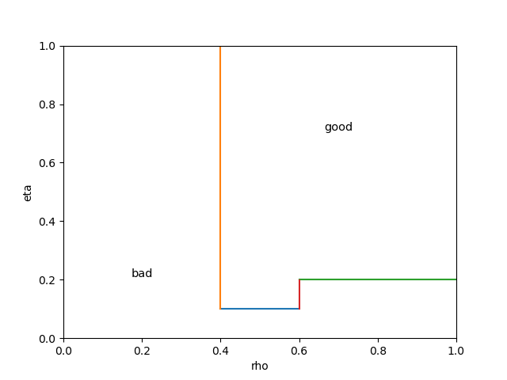
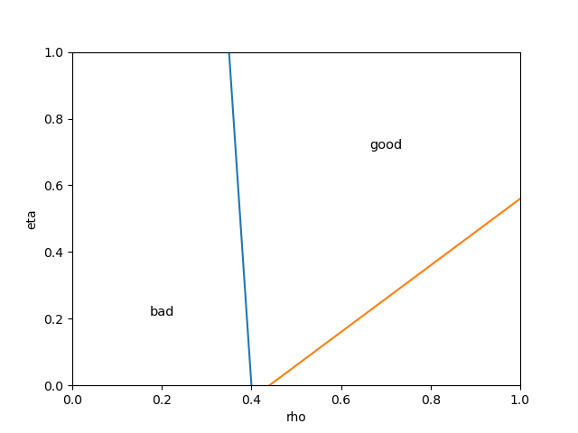
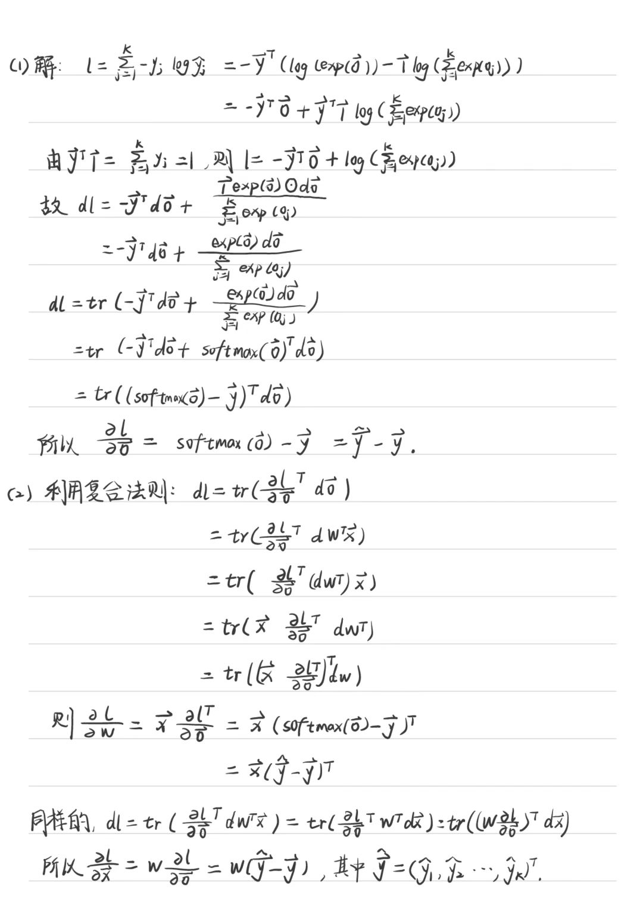
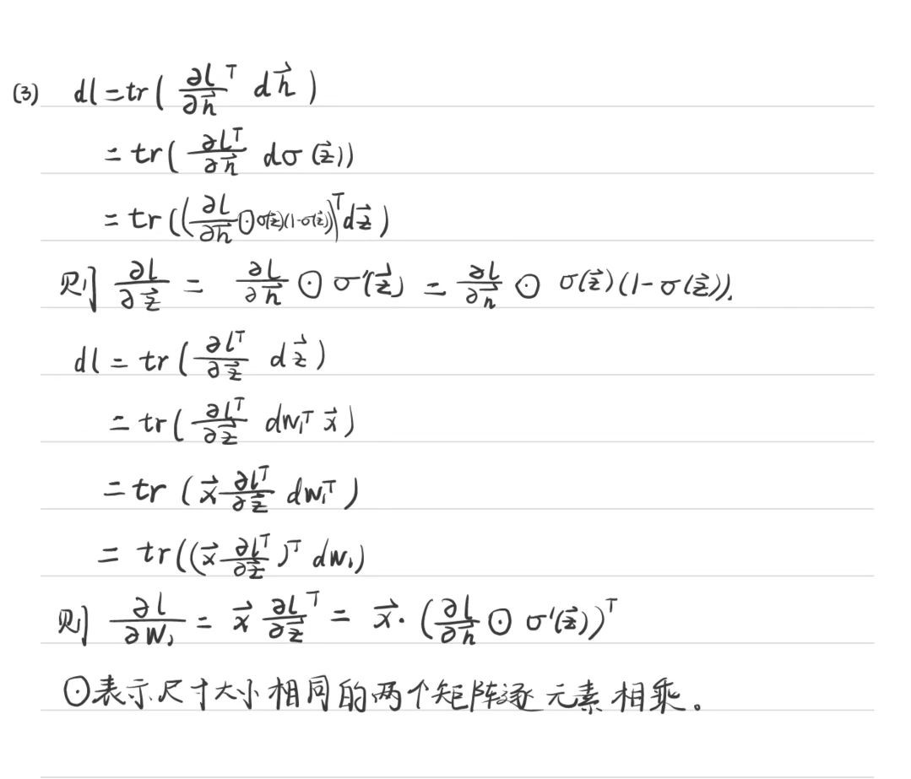
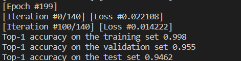
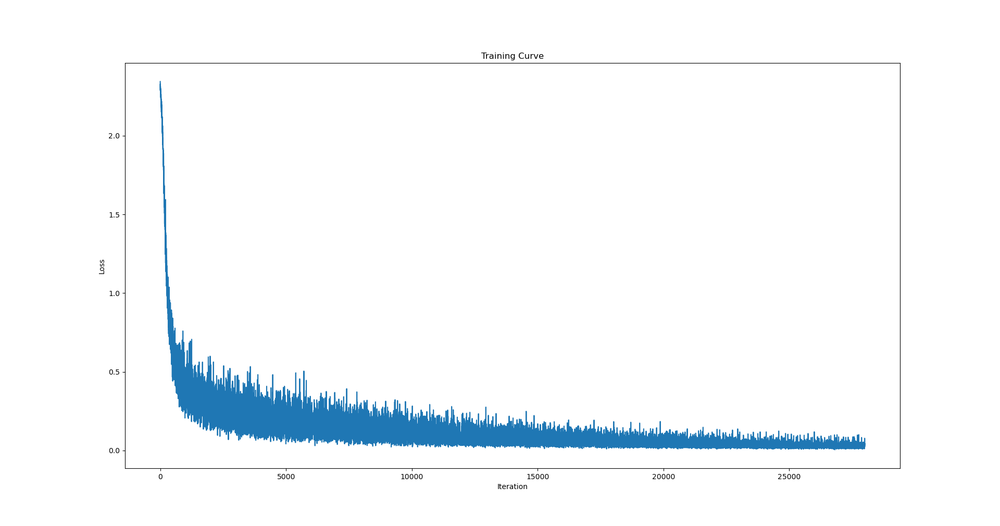

## 人工智能导论第二次作业

### 第一题
* 在进行算法或模型选择时，如果只划分训练集和测试集，会有什么后果？引入验证集后，验证集和测试集在使用时的区别是什么？
  * 如果只划分训练集和测试集，那么模型的泛化能力就无法得到很好的验证。这样会导致模型在实际应用中出现过拟合现象，即模型在训练集上表现良好，但在测试集上表现不佳。
  * 验证集在训练过程中使用，根据评估结果调整超参数；测试集在训练和调整模型完成后使用，对模型进行基准测试。

* 请简述 K 折交叉检验的流程。
  * 将数据集 $D$ 划分成均等不相交的 $K$ 个子集 $D^{(i)}$；
  * 对于$i=1,...,K$，使用除了 $D^{(i)}$ 之外的全部数据训练得到模型 $h^{(i)}$；
  * 通过求所有验证集的错误率（$\epsilon_{D^{(i)}}(h^{(i)})$）的平均值得到交叉验证的错误率。

* 相比于 L2 正则化，L1 正则化有什么特点？除这两者之外，请再列举一种正则化方法。
  * L1 正则化可以使得模型的参数更加稀疏，即对于某些特征，它们的权重会变成 0，从而达到特征选择的效果。
  * 弹性网络（Elastic Net）是一种结合了L1正则化和L2正则化的线性回归模型，Dropout 是训练神经网络时一种常用的正则化方法。

* 在支持向量机 (SVM) 中引入核函数 (Kernel function) 的动机是什么？
  * 在 SVM 中，引入核函数的动机是为了将数据从低维空间映射到高维空间，使得数据在高维空间中更容易被分离。核函数可以将低维空间中的非线性问题转化为高维空间中的线性问题，从而使得SVM可以处理非线性分类问题。

* 随机森林使用哪些方法增加单棵决策树的多样性？
  * Bootstrap Sample：是指从原始数据集中有放回地抽取样本并使得样本集合大小与原数据集一致，生成一系列 bootstrap 伪样本，用选择的样本用来训练多个决策树。
  * 当每个样本有 d 个属性时，在决策树的每个节点需要分裂时，随机从这 d 个属性中选取出 K 个属性（$K = \sqrt{d}$）。然后从这 K 个属性中采用某种策略（比如说信息增益）来选择1个属性作为该节点的分裂属性。

### 第二题
* 训练深度神经网络时，发现网络在训练集上的误差较小，但在测试集上的误差较大。请列举两种可以改进模型或者训练过程的措施。
  * 正则化：通过在损失函数中加入正则项，惩罚模型复杂度，从而避免过拟合。
  * Dropout：在训练过程中随机丢弃一些神经元，可以避免过拟合。

* 卷积神经网络(CNN)是针对图像类型数据特殊设计的网络结构，它的设计基于图像的哪两个基本假设？
  * 局部连接：一般认为图像的空间联系是局部的像素联系比较密切，而距离较远的像素相关性较弱，因此，每个神经元没必要对全局图像进行感知，只要对局部进行感知，然后在更高层将局部的信息综合起来得到全局信息。
  * 参数共享：在局部连接中，每个神经元的参数都是一样的。局部信息的一些统计特性和其他部分是一样的，也就意味着这部分学到的特征也可以用到另一部分上。

* 下图为LeNet网络的计算图。这个网络共有多少层？有哪些层包含可学习的参数？不考虑偏置参数 (Bias)，这些层的可学习参数量分别是多少？
  * 这个网络共有 7 层，包括 3 个卷积层，2 个池化层和 2 个全连接层。
  * 3 个卷积层和 2 个全连接层包含可学习的参数，池化层不包含可学习的参数。
  * 第 1 个卷积层（$32\times32\times1 \to 28\times28\times6$）中卷积核大小为$5\times 5\times 1$，可学习参数量为$5\times 5\times 1\times 6 = 150$；
  * 第 2 个卷积层（$14\times14\times6 \to 10\times10\times16$）中卷积核大小为$5\times 5\times 6$，可学习参数量为$5\times 5\times 6\times 16 = 2400$；
  * 第 3 个卷积层（$5\times5\times16 \to 120\times1\times1$）中卷积核大小为$5\times 5\times 16$，可学习参数量为$5\times 5\times 16\times 120 = 48000$；
  * 第 1 个全连接层($120 \to 84$)中可学习参数量为$120\times 84 =10080$；
  * 第 2 个全连接层($84 \to 10$)中可学习参数量为$84\times 10 = 840$。

* 为了解决深度神经网络难以优化的问题，ResNet在模型架构上提出了哪一改进？
  * 引入残差块的概念，每个残差块由两个卷积层和一个跨层连接组成。跨层连接是指在网络中增加了一条直接连接，使得网络可以更深，同时也可以避免梯度消失和梯度爆炸问题的出现。

* 简述使用循环神经网络(RNN)时的训练技巧（列举两条即可）。
  * Gradient Clipping：梯度裁剪可以通过限制梯度的范数来实现。
  * Variational Dropout：在每个时间步重复相同的dropout掩码，用于输入、输出和循环层（在每个时间步丢弃相同的网络单元）。

### 第三题
* 计算另外五个属性的信息增益。
  * 我们可以计算出根节点的信息熵(Entropy)和使用“根蒂”划分得到的三个子节点的信息熵：
    $$H(D) = 0.998$$
    $$H(D_1) = -\frac{5}{8}log(\frac{5}{8})+\frac{3}{8}log(\frac{3}{8}) = 0.955$$
    $$H(D_2) = -\frac{4}{7}log(\frac{4}{7})+\frac{3}{7}log(\frac{3}{7}) = 0.985$$
    $$H(D_3) = -\frac{2}{2}log(\frac{2}{2}) = 0$$
    从而得到“根蒂”的信息增益：
    $$IG(D,根蒂) = H(D)-(\frac{8}{17}H(D_1)+\frac{7}{17}H(D_2)+\frac{2}{17}H(D_3))=0.143$$
    我们可以计算出使用“敲声”划分得到的三个子节点的信息熵：
    $$H(D_1) =  0.971$$
    $$H(D_2) =  0.971$$
    $$H(D_3) = 0$$
    从而得到“敲声”的信息增益：
    $$IG(D,敲声) =0.141$$
    我们可以计算出使用“纹理”划分得到的三个子节点的信息熵：
    $$H(D_1) =  0.764$$
    $$H(D_2) =  0.722$$
    $$H(D_3) = 0$$
    从而得到“纹理”的信息增益：
    $$IG(D,纹理) =0.381$$
    我们可以计算出使用“脐部”划分得到的三个子节点的信息熵：
    $$H(D_1) =  0.863$$
    $$H(D_2) =  1.0$$
    $$H(D_3) = 0$$
    从而得到“脐部”的信息增益：
    $$IG(D,脐部) =0.290$$
    我们可以计算出使用“触感”划分得到的三个子节点的信息熵：
    $$H(D_1) =  1.0$$
    $$H(D_2) =  0.971$$
    $$H(D_3) = 0$$
    从而得到“触感”的信息增益：
    $$IG(D,触感) =0.007$$
    “纹理”的信息增益最大，所以第一个划分的属性为“纹理”。
* 使用ID3算法建立决策树，每次选择信息增益最大的属性（若有多个则选择排序靠前的）进行划分。请画出ID3算法所得到的完整的决策树。  

* 考虑以下两棵关于密度（$\rho$）、含糖率（$\eta$）两个连续属性的决策树：请在 $\rho-\eta$ 坐标系下分别画出两棵决策树的决策面。
  * 第一棵决策树：  
  

  * 第二棵决策树：  
  

### 第四题
* 试求 $\frac{\partial l}{\partial o}$

* 应用矩阵求导术和链式法则求出 $\frac{\partial l}{\partial W}$ 和 $\frac{\partial l}{\partial x}$
  

* 现在你需要进一步求出 $\frac{\partial l}{\partial W_1}$
  

* MNIST 手写数字数据集上的十分类问题

  代码见 ./p4 文件夹。
  * 调参  
  
  |hidden-dim|50|77|80|100|
  |--|--|--|--|--|
  |accuracy on the training set|0.9845555555555555|0.9835555555555555|0.9844444444444445|0.9828888888888889|
  |accuracy on the validation|0.953|0.936|0.962|0.94|
  |accuracy on the test set|0.9422|0.9432|0.9406|0.9392|

  |lr|0.1|0.09|0.11|
  |-|-|-|-|
  |accuracy on the training set|0.9845555555555555|0.9812222222222222|0.9867777777777778|
  |accuracy on the validation|0.953|0.944|0.947|
  |accuracy on the test set|0.9422|0.9408|0.9396|

  |batch-size|64|77|
  |-|-|-|
  |accuracy on the training set|0.9845555555555555| 0.9787777777777777|
  |accuracy on the validation|0.953|0.948|
  |accuracy on the test set|0.9422|0.9378|
  
  |epoch|100|200|1000|
  |-|-|-|-|
  |accuracy on the training set|0.9845555555555555| 0.998|1.0|
  |accuracy on the validation|0.953|0.955|0.964|
  |accuracy on the test set|0.9422|0.9462|0.952|

  * 较好的一次测试结果及超参数：

  |Hyper-parameters|hidden-dim|lr|batch-size|epoch|
  |-|-|-|-|-|
  ||50|0.1|64|200|

  

  ||train set|validation|test set|
  |-|-|-|-|
  |accuracy|0.998|0.955|0.9462|

  * 此时损失函数的训练曲线：

  

### 第五题

代码见 ./p5 文件夹，实验报告见 ./分类实践实验报告.pdf。